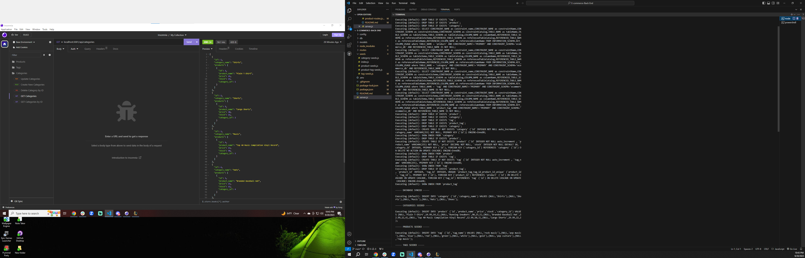

# E-commerce-Back-End

## Description
The current app is the back end for an e-commerce site.
## Video to deployed application
https://drive.google.com/file/d/1tfaVqgwFKYYGvTz-hcgl81xDzsWvfr_q/view
## Screenshot

## Table of Contents
* [Description](#description)
* [Installation](#installation)
* [Languages & Dependencies](#languagesanddependencies)
* [Contributing](#contributing)
* [Testing](#testing)
* [Questions](#questions)
*[Contact-Me](#contact-me)
## Instaallation
You’ll need to use the MySQL2 and Sequelize packages to connect your Express.js API to a MySQL database and the dotenv package to use environment variables to store sensitive data, like MySQL username, password, and database name.
## Languages & Dependencies
Express,MySql,Get routes, Api Post,Put,Delete
## Contributing
Pull requests are welcome. For major changes, please open an issue first to discuss what you would like to change. Please make sure to update tests as appropriate.
## Testing
N/A
## Contact-Me
  * Name - JavierBurgara
  * Email - Javierburgara150@yahoo.com
  * Github - [JavierBurgara](https://github.com/JavierBurgara/)
## Questions
Please send your questions [here](mailto:Javierburgara150@yahoo.com?subject=[GitHub]%20Dev%20Connect) or visit [github/JavierBurgara](https://github.com/JavierBurgara).
